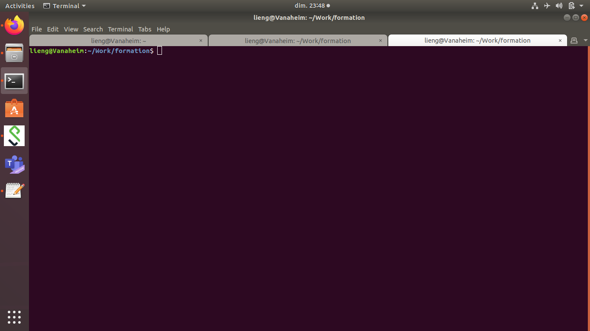
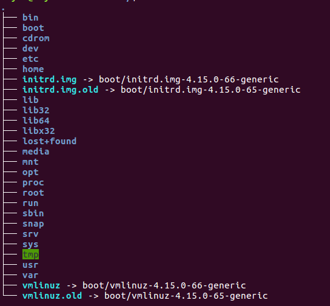
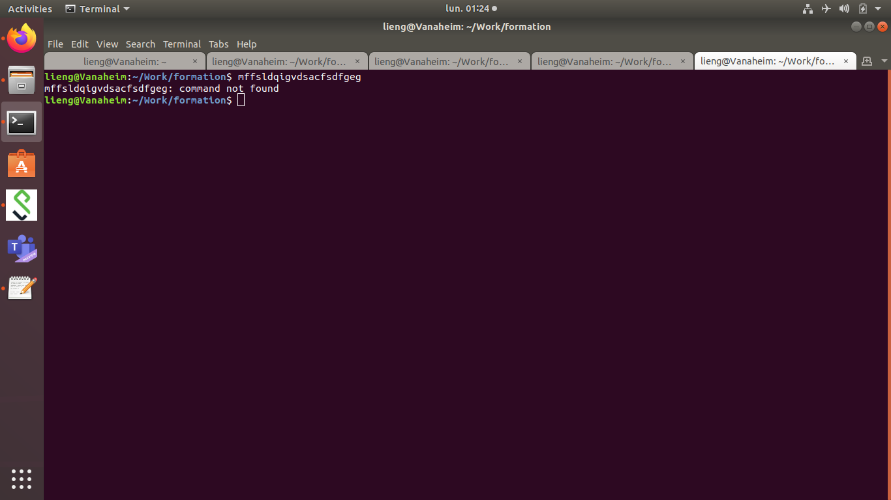

---
output:
  html_document:
    self_contained: yes
    toc: yes
    toc_float: yes
---


# Formation BASH

## Human - Machine

Interaction between the User and the Machine

```{r,echo=FALSE}
library(DiagrammeR)
DiagrammeR::grViz("
digraph Interaction{
	graph [rankdir = LR]
node [width=2]
Input -> Compute -> Output
  { rank=same; Input; Output; }
}",height=100)
```
Smartphone

```{r,echo=FALSE}
library(DiagrammeR)
DiagrammeR::grViz("
digraph boxes_and_circles{
 graph [rankdir = LR]

 node [width=2]
 S[label=\"Touch screen\nMicrophone\"]; A[label=\"application\non the phone\"]; O[label=\"screen\nspeaker\nheadphone\"];

 S->A A->O

 {rank=same; S; O; }
}",height=100)
```

ATM


```{r,echo=FALSE}
library(DiagrammeR)
DiagrammeR::grViz("
digraph boxes_and_circles{
 graph [rankdir = LR]

 node [width=2]
 S[label=\"Function key\nTouchscreen\"]; A[label=\"CPU\"]; O[label=\"Screen\nPrinter\nDispenser\"];

 S->A A->O

 {rank=same; S; O; }
}",height=100)
```

Personal computeur

Inputs
Keyboard/mouse/youchscreen - the computeur - screen/speakers/any other device

What doest the computer?

Input interpretation - program action - output response

Each part of the software consume ressources

exemple Save a file in excel


Possibles inputs
Mouse listener (mouse position/click listener save button/Menu navigation) 
Keyboard command(CTRL+S,ALT+F-ALT+S,ALT+F-arrows-enter)

Program action
Writing a file

Output
The file name doesn't have a star anymore
The save button is grey

Every part of the software hase to be programmed and might consume ressources. At the beginning of informatics and nowdays in some specific cases, you might want to simplify every possible input and output to focus mainly to program.

Shell: Command line interpreter that gave you acces to internal functionalities of the operating system. In other word, your operating system have some built in tools that you can use directly, with keyboard input and minimal output.

**What you should remember?**

```{r,echo=FALSE}
library(DiagrammeR)
DiagrammeR::grViz("
digraph boxes_and_circles{
 graph [rankdir = LR]

 node [width=2]
 Action; I[label=\"Action Interpreteur\"]; C[label=\"Program Action\"]; R[label=\"Program Reaction\"]; Output

 Action->I I->C C->R R->Output

 {rank=same; Action; Output; }
 {rank=same; R; I; }
}",height=100)
```


## BASH

Bash: Bash is the most frequent command line interpretor in most linux distribution

Bash will allow you tu use most of the bioinformatics tools, which are mainly command-line tools.



PS1:primaty prompt string, contain some useful informations or not, customisable

Command zone: provided by the user, usually a command or the name of a script 

## Concepts & Commands

### command and options

command<enter>

**cal**

````
cal
````
command cal - display a **cal**endar


````
cal --help

cal -h

cal --monday

cal -m
````

the options

`-h` or `--help` will give you a brief description of the command what it does and it's different options

by convention

`-` option in its shortform one character, most often short form options can be combined if they make sense

`--` option in its longform considered as human readable

<details>
<summary>To go further</summary>
<p>  
````
cal --year

cal -ym
````

**man**ual

man is a command to acces the build in help of a command.
</p>
</details>

**What you should remember?**

Commands can have options, that alters their behaviours.
Commands usually have a `-h` or a `--help` option.

### argument, variable, case & special character

**echo**

echo <argument><enter>

#### argument

````
echo "hello world"
````

**echo** is a command that output the strings that has been passed as argument

**"hello world"** is the argument passed to the echo command. Since it has several character,it is called a character string, or simply string. **echo** will display on the terminal what is inbetween \"


**What you should remember?**

You can give a command or a program an argument.


#### variable

````
ma_variable_pour_l_example="hello world"
````

**ma_variable_pour_l_example** is a variable, it has a name ma_variable_pour_l_example and we assign it the value "hello world". A variable is a place holder for a value that we may not want to write directly for any reason (multiple access, possible modification, unknown values).

**=** is an operator that will create the variable and initiate it with the value that follows, be careful not to leave some space before or after, otherwise the BASH will interpret it as a command call to ma_variable_pour_l_example.

**_** since BASH interpret spaces as command separator we could not call our variable `ma variable pour l example` otherwise it would have call the `ma` command and `variable pour l example` would have been considered as argument. Since the `-` is by convention reserved to the options, `_` is a good alternatives.

````
echo ma_variable_pour_l_example
echo "${ma_variable_pour_l_example}"
````

BASH will need some special character to interpret it as a variable and not just as a string

`${}` will allow access to the value of the variable. They is some other ways to access variable values but `${}` has proven to be portable between command line interpretors and their different versions.


#### case

````
echo "${Ma_variable_pour_l_example}"
````

For BASH and every other Linux based command line interpretor (everything out of windows) there is a difference between ma_variable_pour_l_example and Ma_variable_pour_l_example. 


##### Recommandations

They is several norms for naming variables but they might not be respected. We will recomand you to:

* don't use full upper case letters 

* name your variable with an human readable name

* avoid any space since they will be rejected by most interpretors

* avoid any special caracter `§%µ£...`

* avoid any reserved caracter `\${}...`

* avoid any punctuation


<details>
<summary>to go further</summary>
<p>  

**escape character**

````
Ma_variable_pour_l_example=${ma_variable_pour_l_example}
````

We can use the value of a variale and copy it to another variable

````
echo "${ma_variable_pour_l_example}${Ma_variable_pour_l_example}"
````

We can use multiple variable in the same call

````
echo -e "${ma_variable_pour_l_example}\n\"${Ma_variable_pour_l_example}\""
````

`-e` is the echo option allowing interpretation of backlash escapes.

The escape character came in two forms:

In `\n`, the backlash(`\`) is there for the interpreter to say that the following one(`n`) is not a regular `n` but is to be considered as a control character. `\n` is a line feed, or a newline character. `\t` is the tabulation character.

In `\"`, the backlash is there for the interpreter to say that the following one(`\"`) is to be considered as a regular character. In this case the `\` is considered as an escape character preventing interpretation of the following character. 


**Naming Convention**

you can enconter several naming convention

Formatting | 	Name(s)
:-:|:-:
twowords | flat case
TWOWORDS |	upper flat case
twoWords |	(lower) camelCase, dromedaryCase
TwoWords |	(upper) CamelCase, PascalCase
two_words |	snake_case, pothole_case
TWO_WORDS |	SCREAMING_SNAKE_CASE, MACRO_CASE, CONSTANT_CASE
Two_Words |	Camel_Snake_Case
two-words |	kebab-case, dash-case, lisp-case
TWO-WORDS |	TRAIN-CASE, COBOL-CASE, SCREAMING-KEBAB-CASE
Two-Words |	Train-Case, HTTP-Header-Case
source wikipedia:[https://en.wikipedia.org/wiki/Naming_convention_(programming)](https://en.wikipedia.org/wiki/Naming_convention_(programming))

**environment vairable**

Some variables are already defined by the operating system for internal operations. Do not use their name since it may create a conflict. They are usually written in capital letters only. They can be access with the `printenv` command.
</p>
</details>

**What you should remember?**

* You can store informations into a variable.
* You can access information of a variable using `${<name_of_the variable>}`.
* Be careful of the letter case, more generally be careful of how you name your variables


### Directory, root directory, path, home, working directory, absolute path, relative path

#### Directory

A directory (also called folder) is a file system cataloging structures that contains references to other computer files and possibly other directories. In other words a directory may have directories inside or files. Directories have a stem leaves structures which is also hierarchical. 

**ls**
To known the content of a directory you can use the ls (**l**i**s**t) command and the path (will be explained later) to the directory as argument. Without arument, `ls` will list everything in the working directory (will also be explained later).

#### root directory

The root directory is the top most directory in a hierarchy. 

In a Unix operating system, it look like this:

````
ls /
````



Most of the linux distribution share the same directory structure àt the top most level In windows, each disk has it's own root. 

#### path

To determine a localisation in the folders hierarchical structure, we use a path.

````
/bioinfo/users/ltaing/CondaCache/Rsystempiper-9f39fb2df62d3251cbebca4ab7700d89/bin
````

the leftiest `/` (called slash) refers to the root each names. `bioinfo` is the name of the folder at the root level and `users` directory is included inside `bioinfo`. Each other slash are considered as folder separator. The rightiest name (`bin` in our case), can either be a folder or a file. In that case, `bin` is a folder.

Since `bin` is a folder, `/bioinfo/users/ltaing/CondaCache/Rsystempiper-9f39fb2df62d3251cbebca4ab7700d89/bin` and `/bioinfo/users/ltaing/CondaCache/Rsystempiper-9f39fb2df62d3251cbebca4ab7700d89/bin/` are equivalent.

#### home directory

The home directory is the directory containing the files (and directories) of a specific user. The concept of home directory is present in all operating system. Usually, it is the active directory when you open a terminal. To know the path to your home you can use the variable `$HOME` such as `echo $HOME`.

Sometimes, you can see `~` as a place holder for the home directory.


#### working directory

**pwd**

Since you open a terminal and until you close it, you are somewhere in the file system. That somewhere is called the working directory. When you open a terminal, your working directory is your home directory. To known the current working directory you can use the `pwd` command (**p**rint **w**orking **d**irectory).

**cd**

If you want to change the directory you can use the cd (**c**hange **d**irectory) command.

cd <path to the destination's directory>

````
cd /
ls
pwd
cd $HOME
ls
pwd
````

if you don't precise a destination directory, cd will change the directory to the home directory.

**self directory:.** 

`.` is a shortcut from the current directory to the current directory

````
cd $HOME
ls -a
pwd
cd .
pwd
````

Not very useful for now, but quite illustrative.

**parent directory:..** 

`..` is a shortcut from the current directory to the parent directory (one directory above in the tree).

````
cd $HOME
pwd
cd ..
pwd
cd $USER
pwd
````

Every directory have a `..` shortcut even the root directory. In that case it point to the root directory itself. 

**absolute and relative path**

When we look at a path, they're is two possible origins:

* from the current directory, the path is then called relative path. Technically a relative path is something that begins with `./` but its presence is not mandatory and most often omitted.


* from the root directory, the path is then called absolute path. Even if it can handle `..` in it's folders, an absolute path should be the most direct path to the destination.

As long as they point to the same location they are strictly similar. Depending on the circusmstances one might be more fitted to the other.

#### create and delete directories

**mkdir** <name of the directory to create>

make directory named <name of the directory to create> from the working directory

````
pwd
mkdir example_directory
cd example_directory
pwd
cd ..
mkdir example_directory
````

If the working directory already contains a `example_directory`, mkdir will output (return) an error message. 


**rmdir** <name of the directory to delete>

````
ls 
rmdir example_directory
ls 
````

If the working directory do not contains a `example_directory`, rmdir will output (return) an error message. 

**What you should remember?**

* You are always in a directory. The shortcut to the directory where you are located is called **working directory**.
* `pwd` will print your working directory.
* The **root** directory is the top most directory in the hierarchical structure of directories.
* A path is the folder succession to destination (wherever it is a file or a directory).
* An absolute path is a path from the root directory
* A relative path is a patf from the working directory

### File, copy, move, remove

A file is a computer ressource to record ny kind of data (text, sound, video, picture, software). Most of the time they contain an extension (.txt for example) to indicate the kind of stored data

we can distinguate two kind of files:

* **text file** also refered as flat file. These files contains text that can be directly read within the shell

* **binary file** any other kind of file that can not be directly read from the shell


**touch**

````
mkdir example_directory
cd example_directory
touch exemple_file_a.txt
ls -al --time-style=full-iso
````

touch create an empty file, the 5th column of the `ls -al` is the file size, in our case it should be 0. It is a misuse of the touch programs.


#### cp

**c**o**p**y  a file

copy <path of the source> <path of the destination>

copy as its name might suggest create a copy of the source to the destination

````
touch exemple_file_a.txt
ls -al --time-style=full-iso
cp exemple_file_a.txt exemple_file_b.txt
ls -al --time-style=full-iso
mkdir exemple_directory_b
cp exemple_file_a.txt exemple_directory_b/.
````

Since copy do not alter the source destination, it remains what it was before the copy call. In the last command we ask copy to copy `exemple_file_a.txt` into the directory


#### rm

**r**e**m**ove  a file

rm <path of the file to remove>


````
touch exemple_file_to_be_remove.txt
ls -al --time-style=full-iso
rm -i exemple_file_to_be_remove.txt
ls -al --time-style=full-iso
````

````
touch exemple_file_to_be_remove.txt
ls -al --time-style=full-iso
rm exemple_file_to_be_remove.txt
````

Be careful of what you remove, since rm do not ask for any confirmation and that the file is not store in a trash bin folder, it will be lost forever.

#### mv

**m**o**v**e

move -i <path of the source> <path of the destination>

move change the location of the source file to the location of the destination. It will remove the source file.

````
mv -i exemple_file_a.txt exemple_file_c.txt
ls -al --time-style=full-iso
mv -i exemple_file_c.txt exemple_file_b.txt
````

Be careful of overwritting pre existing files, if the `-i` weren't present, mv would have simply replace pre existing `exemple_file_b.txt`.

**What you should remember?**

* You can directly read a text file. You can not directly read a binary file.
* copy <source> <destination>
* rm <target>
* mv = cp <source> <destination> then rm <source>


### text file: cat, head, tail, more

#### cat

con**cat**enate

The command reads files sequentially and write them to standard output. Cat can read any text file and will dispolay it on termional.


in the folder where this example is located, try:
````
cat fastqc_data.txt
````

#### head 

**head** will allow you to access to the first lines of a flat files.

````
head fastqc_data.txt
````

#### tail

**tail** will allow you to access to the last lines of a flat files.

````
tail fastqc_data.txt
````

#### more 

**more** allows you to display a text file, page by page and use space to moove to the **next** page

````
more fastqc_data.txt
````

### less


**What you should remember?**

* cat Print everything
* head print the first 10 lines
* tails print the last 10 lines
* more page by page display

## Permissions

### ownership

Each file or directory bleongs to a user and a group. To know the owner of a file, you can use the `ls -l` information. The owner information is displayed in the second column. The third column is the owner information.
 

In most of operating system, permissions are the rights that you have on a file or a directory.


From the owner point of view: 
### read

If you have the **r**ead rigth then you can read it, in the shell or using any fitted program. The read rights means that you can use a program to read it such as cat or any text editor. It means also that if you don't have the read rights, you can't use any unix tools or program to access it such as `cp` or `cat` for example. 

### write

If you have the **w**right rigth then you can wright it, in the shell or using any fitted program. It means that you can modify (add/delete) all or part of it.

### execute

If you have the e**x**ecute rigth then you can execute it wherever it is a text file (called a script) or a binary file (program of application), in the shell or using any fitted program.

### chmod

To know the rights that you have on a file. you can une the `ls` command with the `-l` options. The right are displayed in the first columns caracter 2 to 5. If you have a right, the corresponding letter is displayed if not, an hyphen is displayed.

**ch**ange **mod**e 

If you want to change the rights that you have on a right you can use the `chmod` command.

````
ls -l fastqc_data.txt
cat fastqc_data.txt
chmod u-r fastqc_data.txt
ls -l fastqc_data.txt
cat fastqc_data.txt
chmod u+r fastqc_data.txt
ls -l fastqc_data.txt
cat fastqc_data.txt
````

The `u-r` option means for the user (you) remove the read right. The `u+r` option mean for the user (still you) to add the read rigth. You can only change the rights of the files that you own. You can encounter other way to defined rights to a file base on number but for a simple use, we recommand you to stay with this formalism until you are more familiar with shell.

<details>
<summary>to go further</summary>
<p>  

In the `ls -l` output, we can see that there is place for other users rights. You are defined as **u**ser. Other users are defined by the relation they share with you. You also belongs to a **g**roup, at least a group of yourself. You may want to share some rights with the group and not to unknown users or users outsite the group. The third and last group of users are the **o**thers.

The directories also have rights. You need the execute permissions to cross a directory.

</p>
</details>

**What you should remember?**

* Somebody owns a file or a directory, the owner.
* everythings is based from the owner point of view, the user, the group and the other
* read can open it, can copy it
* write can open it, modify it
* execute can execute it.
* directories have rights also


### looking for a string

**grep**

grep is a powerful tool to look into an input (most likely a text file) and select lines that fit a pattern and print the result it into the shell.

grep "<pattern>" <file to look into> 

from the example file:
````
grep "total" fastq_report.txt
````

##sed**

**s**tring **ed**itor

usage:

sed s/<motif to replace>/<replace motif>/

````
sed s/lieng/tom/ example_ls_output.txt
````

As you can see only the first occurence of lieng is substitute in each line.

If you wan to susbtitute every occurence of lieng, you have to add the global option.

sed s/<motif to replace>/<replace motif>/g


**What you should remember?**

* You can search for a specific string into a file.
* You can replace a specific string with the string of your choice in a file.

### scripts

In some occasions, it can be more convenient to store instructions (commands) in a file and executes theses instructions in one time. A file with bash instruction is then called a bash script. By convention, it has a `.sh` extension. In that script file, each instuction is on a new line. They will be executed sequentially (one by one, from top to bottom) and each instruction will have to finish before going to the next one.

Before executing a bash script, you need the execution rights.

To add the execution rights to a script that you own you must use the `chmod` command with the `u+x` argument.

To execute a script you simply need to enter the path to it.

Assuming that you are in the repertory where the script is located:

./<name of the script>.sh

Depending on configuration, you may be able to simply use the name without using the `./`

You can also execute a script that is not in the working directory by using it path (absolute or relative)

<path to the script directory>/<name of the script>.sh


## streams

### standard streams

Each programs (unix tools, script, applications) can use 3 streams to interact with the user.

#### stdin

The **st**andard **in**put consist of all the keyboard input since the program is called.

example:
````
touch example_file.txt
rm -i example_file.txt
````

When using the `-i` option, `rm` is waiting for some standard input (keyboard input) before acting. In this case `touch` do not use any standard input `example_file.txt` is an argument. Standard input may not be mandatory.

#### stdout

The **st**andard **out**put consist of what the program should exit during a regular execution.

````
pwd
````

The path to the working directory is displayed on screen and constitute the standard output of `pwd`. As for the standard input, the stdout input may not be mandatory, for example `cp` or `mv` doesn't have any standard output(in their regular use).

#### stderr

The **st**andard **err**or consist of what the program should exit during an (anticipated) irregular execution.

````
mffsldqigvdsacfsdfgeg
````
Of course `mffsldqigvdsacfsdfgeg` do not exists and nothing should be expected. But since calling an non existant software is an irregular execution, bash (and most shell) will output and error message.



Be careful, not all program have build in validity test. A program may encounter an issue whitout printing an error due to several reasons (conception's choice, poor conception, unanticipated error).

In some environment, your standard error stream may be emphazised (colored in red).

**What you should remember?**

* The streams may or may not be used by a program, depending of the context and the programmers.
* the standard input is everything that can be input into a program, out of its arguments and options.
* the standard output is everything that a program should output, most likely into the terminal.
* the standard error is everything that a program should output if an irregular use occurs, most likely into the terminal, must be anticipated by the programmers.

### stream redirection

Until now we have seen concept that are shared between every operating system. Each concept and command have their counterpart in windows either in DOS or powershell. There is also some subtilities in the permission system in windows but the concept remains identicals.

<details>
<summary>to go further</summary>
<p>  
Here is a list of corresponding tools between Windows shell (DOS or Powershell) and unix system : [here](https://www.lemoda.net/windows/windows2unix/windows2unix.html)
<p>

The stream redirection is one of the powerful tools that are specific to the UNIX/LINUX operating system. The main idea is that the output  stream of a program can be piped into the input stream of another program or directly into a file.

### stream into a file

**>**

usage:

comand [options] <arguments> > <output file>

The `>` operator allow you to redirect the standard output stream in to a file.

exemple:

````
rm inventory.txt
ls /usr/local/bin > inventory.txt
more inventory.txt
ls /usr/local > inventory.txt
more inventory.txt
````

As you can observe in the exemple, the `>` operator redirect the standard output into the inventory text file. If inventory.txt does not exists, the `>` operator will create it.  The `>` overwrite any previous version of inventory.txt whithout any warning so be careful of its usage.

**>>**

In case you wish to keep the previous information of a file, the `>>` will write the new information a the end of a file.

usage:

comand [options] <arguments> >> <output file>

exemple:

````
rm inventory.txt
ls /usr/local/bin >> inventory.txt
more inventory.txt
ls /usr/local >> inventory.txt
more inventory.txt
````
As you can observe, the `>>` operator will create the file if it doesn't exists and will write the output stream at the end of it (which can be considered as the begening since it will be and empty file).

<details>
<summary>to go further</summary>
<p>
Actually the output stream is the by default stream to be use in redirection. But as we saw earlier, another stream is available. To distinguish the 2 streams we can use `1>` for the standard output and `2>` for the error output. By convention, `>` is equivalent to `1>`.

If you want to redirect both stream simultenouslty into one file, you can use the `&>` operator.

If you want to redirect both stream simultenouslty into two different files, you can use the `1>` and `2>` in the same command.

command [options] <arguments> 1> stdout_file.txt 2> stdout_file.txt 

Be careful not to leave some space between the character.
<p>

### stream from a file

**<**

usage:

comand [options] <arguments> < <output file>

The `<` operator allow you to redirect a file into the standard input stream.

In the example directory
```
grep "Total Sequences" <  fastqc_data.txt
```

### flux de redirection: vers une autre commande |

More powerful than writting into files, you can output stream of a first program into the input stream of a second program by using the `|` (called pipe) operator.

usage:
<command 1> | <command 2> 

In the example directory
```
grep "Total Sequences" fastqc_data.txt | sed "s/Total//"
grep "Total Sequences" fastqc_data.txt | sed "s/Total//" | sed "s/Sequences//"
grep "Total Sequences" fastqc_data.txt | sed "s/Total//" | sed "s/Sequences//" | sed "s/ //"
grep "Total Sequences" fastqc_data.txt | sed "s/Total//" | sed "s/Sequences//" | sed "s/ //" | sed "s/\t//"
```

Welcome into a world of endless possibilities :).

**What you should remember?**

* You can redirect the streams into a file
* `>` create and write or overwrite a file
* `>>` write at the end of a file
* `|` into another process


## Usages récurents

### Se connecter à une machine distantes

ssh <username in distant machine>@<distant machine identificator>

### Copier un fichier entres machines distantes

scp <username in source machine>@<source machine identificator>:<path to the source file> <username in destination machine>@<detination machine identificator>:<path to the destination file>

## Expresssion regulieres


