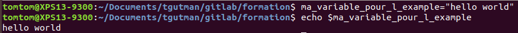
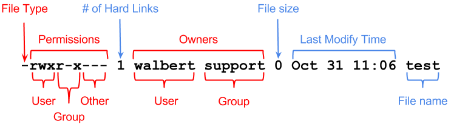
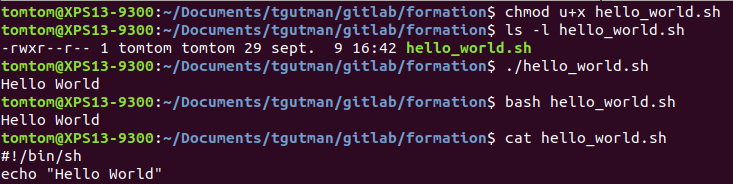

Interactions between the **user** and the **machine**

```{r,echo=FALSE}
library(DiagrammeR)
DiagrammeR::grViz("
digraph Interaction{
	graph [rankdir = LR]
node [width=2]
Input -> Compute -> Output
  { rank=same; Input; Output; }
}",height=100)
```

**Smartphone**

```{r,echo=FALSE}
library(DiagrammeR)
DiagrammeR::grViz("
digraph boxes_and_circles{
 graph [rankdir = LR]

 node [width=2]
 S[label=\"Touch screen\nMicrophone\"]; A[label=\"application\non the phone\"]; O[label=\"screen\nspeaker\nheadphone\"];

 S->A A->O

 {rank=same; S; O; }
}",height=200)
```

**ATM**

```{r,echo=FALSE}
library(DiagrammeR)
DiagrammeR::grViz("
digraph boxes_and_circles{
 graph [rankdir = LR]

 node [width=2]
 S[label=\"Function key\nTouchscreen\"]; A[label=\"CPU\"]; O[label=\"Screen\nPrinter\nDispenser\"];

 S->A A->O

 {rank=same; S; O; }
}",height=200)
```

**Personal computeur**

```{r,echo=FALSE}
library(DiagrammeR)
DiagrammeR::grViz("
digraph boxes_and_circles{
 graph [rankdir = LR]

 node [width=2]
 S[label=\"keyboard\nMouse\nTouch Screen\"]; A[label=\"Computer\"]; O[label=\"Screen\nSpeaker\nany other device\"];

 S->A A->O

 {rank=same; S; O; }
}",height=200)
```

**What does the computer?**

```{r,echo=FALSE}
library(DiagrammeR)
DiagrammeR::grViz("
digraph boxes_and_circles{
 graph [rankdir = LR]

 node [width=2]
 Inputs[label=\"Input interpretation\"]; A[label=\"Program action\"]; O[label=\"Output response\"];

 Inputs->A A->O

}",height=200)
```

Each part of the software consume ressources

example:

**Save a file in excel**
```{r,echo=FALSE}
DiagrammeR::grViz("
digraph boxes_and_circles{
 graph [rankdir = LR]

 node [width=2, shape = box, height=4]
 Listener[label=\"User possible inputs:\nMouse position & button\nSave button\nMenu navigation\nKeyboard command(CTRL+S,ALT+F->ALT+S)\"]; A[label=\"Program action:\n Save the file\"]; O[label=\"Output response:\nLoading bar is displayed during the  writting\nThe file name does not have a star anymore\nThe save button is grey\"];

 Listener->A A->O

}",height=300)
```

Every part of the software has to be programmed and might consume ressources. At the beginning of informatics and nowdays in some specific cases, you might want to simplify every possible input and output to focus mainly on the program.

**Shell:** Command line interpreter (CLI) that gave you acces to internal functionalities of the operating system. In other word, your operating system have some built in tools that you can use directly, with keyboard input and minimal output.  


**What you should remember?**

```{r,echo=FALSE}
library(DiagrammeR)
DiagrammeR::grViz("
digraph boxes_and_circles{
 graph [rankdir = LR]

 node [width=2]
 Action; I[label=\"Action Interpreteur\"]; C[label=\"Program Action\"]; R[label=\"Program Reaction\"]; Output

 Action->I I->C C->R R->Output

 {rank=same; Action; Output; }
 {rank=same; R; I; }
}",height=100)
```

  
---

# BASH

**Bash:** Bash is the most frequent command line interpretor in most linux distribution.

Bash will allow you tu use most of the bioinformatics tools, which are mainly command-line tools.

<center>


</center>

**PS1:** primary prompt string, contain some useful informations or not, customisable

## Command and options

Archetypal use: `command [options]<enter>`

**cal**

display a **cal**endar

````
cal

cal --help

cal -h

cal --monday

cal -m
````

Options:

* `-h` or `--help` will give you a brief description of the command what it does and it's different options

by convention:

* `-` option in its shortform one character, most often short form options can be combined if they make sense

* `--` option in its longform considered as human readable

<br>

<details>
<summary>To go further</summary>
<p>  
````
cal --year

cal -ym
````

**man**ual

Archetypal use: `man [options] <command><enter>`

man is a command to acces the build in help of a command.

* use `space` button to scroll to the next page

* use `q` to quit

````
man cal

man man
````

**man** description can be a little bit austere
</p>
</details>

<br>

**What you should remember?**

Commands can have options, that alters their behaviours.
Commands usually have a `-h` or a `--help` option.

## Argument, variable, case & special character

**echo**

Archetypal use: `echo [options] <argument><enter>`

### Argument

````
echo "hello world"
````

**echo** is a command that output the string that has been passed as argument.

**"hello world"** is the argument passed to the echo command. Since it has several character,it is called a character string, or simply string. **echo** will display on the terminal what is inbetween \".

<br>

<details>
<summary>To go further</summary>
<p>  
Technically an option is a reserved argument. Both have to be anticipated by the programmers.
<p>
</details>

<br>

**What you should remember?**

You can give to a command or a program an argument.

<br>

### Variable

Archetypal use: `<name of my variable>=<value of my variable><enter>`


````
ma_variable_pour_l_exemple="hello world"
````

**ma_variable_pour_l_exemple** is a **variable**, it has a name \"ma_variable_pour_l_exemple\" and we assign it the value "hello world".  
A variable is a place holder for a value that we may not want to write directly for any reason (multiple access across the file, possible modification, unknown value before execution of code).

**=** is an **operator** that will create the variable and initiate it with the value that follows, be careful not to leave some space before or after, otherwise the BASH will interpret it as a command call to ma_variable_pour_l_exemple, which should results to an error.

**\_** since BASH interpret spaces as command separator we could not call our variable `ma variable pour l exemple` otherwise it would have call the `ma` command and `variable pour l exemple` would have been considered as arguments. Since the `-` is by convention reserved to the options, `_` is a good alternative.

````
echo ma_variable_pour_l_exemple
echo "${ma_variable_pour_l_exemple}"
````

BASH will need some special character to interpret it as a variable and not just as a simple string.

`${}` will allow access to the value of the variable. There is some other ways to access variable values but `${}` has proven to be portable between command line interpretors and their different versions.

<center>




</center>

<br>

### Case

````
echo "${Ma_variable_pour_l_exemple}"
````

For BASH and every other Linux based command line interpretor (everything out of windows DOS or powershell) there is a difference between **m**a_variable_pour_l_exemple and **M**a_variable_pour_l_exemple. 

<br>

### Recommandations

They is several norms for naming variables but they might not be respected. We will recomand you to:

* don't use full upper case letters 

* name your variable with an human readable name

* avoid any space since they will be rejected by most interpretors

* avoid any special caracter `§%µ£...`

* avoid any reserved caracter `\${}...`

* avoid any punctuation

<br> 

<details>
<summary>to go further</summary>
<p>  

**escape character**

````
Ma_variable_pour_l_exemple=${ma_variable_pour_l_exemple}
````

We can use the value of a variale and copy it to another variable

````
echo "${ma_variable_pour_l_exemple}${Ma_variable_pour_l_exemple}"
````

We can use several variables in the same call

````
echo -e "${ma_variable_pour_l_exemple}\n\"${Ma_variable_pour_l_exemple}\""
````

<br> 

`-e` is the echo option allowing interpretation of backslash escapes.

The escape character came in two forms:

In `\n`, the backslash (`\`) is there for the interpreter to say that the following one (`n`) is not a regular `n` but is to be considered as a control character. `\n` is a line feed, or a newline character. `\t` is the tabulation character.

In `\"`, the backslash is there for the interpreter to say that the following one(`\"`) is to be considered as a regular character. In this case the `\` is considered as an escape character preventing interpretation of the following character. 

<br> 

**Naming Convention**

You can encounter several naming convention:

Formatting | 	Name(s)
:-:|:-:
twowords | flat case
TWOWORDS |	upper flat case
twoWords |	(lower) camelCase, dromedaryCase
TwoWords |	(upper) CamelCase, PascalCase
two_words |	snake_case, pothole_case
TWO_WORDS |	SCREAMING_SNAKE_CASE, MACRO_CASE, CONSTANT_CASE
Two_Words |	Camel_Snake_Case
two-words |	kebab-case, dash-case, lisp-case
TWO-WORDS |	TRAIN-CASE, COBOL-CASE, SCREAMING-KEBAB-CASE
Two-Words |	Train-Case, HTTP-Header-Case
source wikipedia:[https://en.wikipedia.org/wiki/Naming_convention_(programming)](https://en.wikipedia.org/wiki/Naming_convention_(programming))

<br> 

**environment vairable**

Some variables are already defined by the operating system for internal operations. Do not use their name since it may create a conflict. They are usually written in capital letters only. They can be access with the `printenv` command.
</p>
</details>

<br> 

**What you should remember?**

* You can store informations into a variable.

* You can access information of a variable using `${<name_of_the variable>}`.

* Be careful of the letter case, more generally be careful of how you name your variables

<br> 

## Directory, root directory, path, home, working directory, absolute path, relative path

### Directory

A directory (also called folder) is a file system cataloging structures that contains references to other computer files and possibly other directories. In other words, a directory may have directories inside or files. Directories have a stem leaves structures (parent - children) which is also considered as a hierarchical structure. 

**ls**

Archetypal use: `ls [options] <path to the folder to list><enter>`

To know the content of a directory you can use the ls (**l**i**s**t) command and the path (will be explained later) to the directory as argument. Without arument, `ls` will list everything in the working directory (will also be explained later).

If you don't provide a path to a folder, ls will list the working directory.

<center>


</center>

### root directory

The root directory is the top most directory in a hierarchy. 

In a Unix operating system, it look like this:

````
ls /
````

<center>


</center>

Most of the linux distribution share the same directory structure at the top most level. In windows, each disk has it's own root. 

### Path

To determine a localisation in the folders hierarchical structure, we use a path.

````
/bioinfo/users/ltaing/CondaCache/Rsystempiper-9f39fb2df62d3251cbebca4ab7700d89/bin
````

The leftiest `/` (called slash) refers to the root each names. `bioinfo` is the name of the folder at the root level and `users` directory is included inside `bioinfo`. Each other slash are considered as folder separator. The rightiest name (`bin` in our case), can either be a folder or a file. In that case, `bin` is a folder.

Since `bin` is a folder, `/bioinfo/users/ltaing/CondaCache/Rsystempiper-9f39fb2df62d3251cbebca4ab7700d89/bin` and `/bioinfo/users/ltaing/CondaCache/Rsystempiper-9f39fb2df62d3251cbebca4ab7700d89/bin/` are equivalent.

In windows the folder separator is '\' (backslash or antislash).

### Home directory

The home directory is the directory containing the files (and directories) of a specific user. The concept of home directory is present in all operating system. Usually, it is the active directory when you open a terminal. To know the path to your home you can use the environment variable `$HOME` such as `echo $HOME`.

Sometimes, you can see `~` as a place holder for the home directory.

<center>


</center>

### Working directory

**pwd**

Archetypal use: `pwd [options]<enter>`


Since you open a terminal and until you close it, you are somewhere in the file system. That somewhere is called the working directory. When you open a terminal, your working directory is your home directory. To known the current working directory you can use the `pwd` command (**p**rint **w**orking **d**irectory).

<center>


</center>

**cd**

Archetypal use: `cd [options] <path to the destination><enter>`

If you want to change the directory you can use the cd (**c**hange **d**irectory) command.


````
cd /
ls
pwd
cd $HOME
ls
pwd
````

If you don't precise a destination directory, cd will **c**hange the **d**irectory to the home directory.

**self directory:.** 

`.` is a shortcut from the current directory to the current directory.

````
cd $HOME
ls -a
pwd
cd .
pwd
````

Not very useful for now, but quite illustrative.

**parent directory:..** 

`..` is a shortcut from the current directory to the parent directory (one directory above in the tree).

````
cd $HOME
pwd
cd ..
pwd
cd $USER
pwd
````

Every directory have a `..` shortcut even the root directory. In that case it point to the root directory itself. 

**absolute and relative path**

When we look at a path, they're is two possible origins:

* **from the current directory**, the path is then called **relative path**. Technically a relative path is something that begins with `./` but its presence is not mandatory and most often omitted.


* **from the root directory**, the path is then called **absolute path**. Even if it can handle `..` in it's folders, an absolute path should be the most direct path to the destination.

As long as they point to the same location they are strictly similar. Depending on the circusmstances one might be more fitted to the other.

<center>


</center>

<br>

### create and delete directories

Archetypal use: `mkdir [options] <name of the directory to create><enter>`

**m**a**k**e **dir**ectory named <name of the directory to create> inside the working directory.

````
pwd
mkdir example_directory
cd example_directory
pwd
cd ..
mkdir example_directory
````

If the working directory already contains a `example_directory`, mkdir will output (return) an error message. 

<br>

<details>
<summary>to go further</summary>
<p>  

You can also provide a path to the directory that you want to create. By default, only the lastest directory of a path can be created, meaning that every other directory in the path must exists before.
<p>
</details>

<br>

**rmdir**

**r**e**m**ove **dir**ectory named <path of the directory to delete>

Archetypal use: `rmdir [options] <name of the directory to delete><enter>`

````
ls 
rmdir example_directory
ls 
````

If the working directory do not contains a `example_directory`, rmdir will output (return) an error message. 

<details>
<summary>to go further</summary>
<p>  
<center>


</center>
<p>
</details>

<br>

**What you should remember?**

* You are always in a directory. The shortcut to the directory where you are located is called **working directory**.

* `pwd` will print your working directory.

* The **root** directory is the top most directory in the hierarchical structure of directories.

* A path is the folder succession to destination (wherever it is a file or a directory).

* An absolute path is a path from the root directory

* A relative path is a patf from the working directory

## File, copy, move, remove

A file is a computer ressource to record any kind of data (text, sound, video, picture, software). Most of the time they contain an extension (`.txt` for example) to indicate the kind of stored data.

We can distinguate two kind of files:

* **text file** also refered as flat file. These files contains text that can be directly read within the shell

* **binary file** any other kind of file that can not be directly read from the shell. Since the beginning of this lesson, every command or program that we use are binary files.

**touch**

Archetypal use: `touch [options] <file that you want to create><enter>`

````
mkdir example_directory
cd example_directory
touch example_file_a.txt
ls -al --time-style=full-iso
````

Touch create an empty file, the 5th column of the `ls -al` is the file size, in our case it should be 0. It is a misuse of the touch programs.

### Copy

**c**o**p**y  a file

Archetypal use: `cp [options] <path of the source> <path of the destination><enter>`

Copy as its name might suggest create a copy of the source to the destination.

````
touch example_file_a.txt
ls -al --time-style=full-iso
cp example_file_a.txt example_file_b.txt
ls -al --time-style=full-iso
mkdir example_directory_b
cp example_file_a.txt example_directory_b/.
````

Since copy do not alter the source destination, it remains what it was before the copy call. In the last command we ask copy to copy `example_file_a.txt` into the directory

### Remove

**r**e**m**ove  a file

Archetypal use: `rm [options] <path of the file to remove><enter>`

````
touch example_file_to_be_remove.txt
ls -al --time-style=full-iso
rm -i example_file_to_be_remove.txt
ls -al --time-style=full-iso
touch example_file_to_be_remove.txt
ls -al --time-style=full-iso
rm example_file_to_be_remove.txt
````

Be careful of what you remove, since rm do not ask for any confirmation and that the file is not store in a trash bin directory, it will be lost forever.

### Move

**m**o**v**e

Archetypal use: `mv [options] <path of the source> <path of the destination><enter>`

move change the location of the source file to the location of the destination. It will remove the source file.

````
touch example_file_a.txt
touch example_file_b.txt
ls -al --time-style=full-iso
mv -i example_file_a.txt example_file_c.txt
ls -al --time-style=full-iso
mv -i example_file_c.txt example_file_b.txt
````

Be careful of overwritting pre existing files, if the `-i` weren't present, mv would have simply replace pre existing `example_file_b.txt`.

<br>

**What you should remember?**

* You can directly read a text file. You can not directly read a binary file.

* copy `<source> <destination>`

* rm `<target>`

* mv = cp `<source> <destination>` then rm `<source>`

## Text file: cat, head, tail, more, less

### cat

con**cat**enate

Archetypal use: `cat [options] <path of the file to concatenate><enter>`

The command reads files sequentially and write them to standard output. Cat can read any text file and will dispolay it on terminal.


In the folder where this example is located, try:
````
cat fastqc_data.txt
````

<br>

### head 

Archetypal use: `head [options] <path of the file><enter>`

**head** will allow you to access to the first lines of a flat files.

````
head fastqc_data.txt
````

<br>

### tail

Archetypal use: `tail [options] <path of the file><enter>`

**tail** will allow you to access to the last lines of a flat files.

````
tail fastqc_data.txt
````

<br>

### more 

Archetypal use: `more [options] <path of the file><enter>`

**more** allows you to display a text file, page by page and use `space` to moove to the **next** page, `arrows` to moove line by line and `q` to quit. 

````
more fastqc_data.txt
````

### less

Archetypal use: `less [options] <path of the file><enter>`

**less** is very similar to **more**. Its use is identical but the file to display is in a separate window. 

````
less fastqc_data.txt
````

<br>

**What you should remember?**

* cat Print everything

* head print the first 10 lines

* tails print the last 10 lines

* more page by page display

---

# Permissions

## Ownership

Each file or directory belongs to a user and a group. To know the owner of a file, you can use the `ls -l` information. The owner information is displayed in the third column. The owner of a file can change permissions on this file.
The right for owner, group and other are displayed in the first columns. If you have a right, the corresponding letter is displayed if not, an hyphen is displayed.

In most of operating system, permissions are the rights that you have on a file or a directory.

**Example**

<center>




</center>
From the owner point of view: 

## Read

If you have the **r**ead right then you can read it, in the shell or using any fitted program. The read rights means that you can use a program to read it such as cat or any text editor. It means also that if you don't have the read rights, you can't use any unix tools or program to access it such as `cp` or `cat` for example. 

## Write

If you have the **w**right right then you can write it, in the shell or using any fitted program. It means that you can modify (add/delete) all or part of it.

## Execute

If you have the e**x**ecute right then you can execute it whether it is a text file (called a script) or a binary file (program of application), in the shell or using any fitted program.

## Chmod

**ch**ange **mod**e 

If you want to change the rights that you have on a file you can use the `chmod` command.

````
ls -l fastqc_data.txt
cat fastqc_data.txt
chmod u-r fastqc_data.txt
ls -l fastqc_data.txt
cat fastqc_data.txt
chmod u+r fastqc_data.txt
ls -l fastqc_data.txt
cat fastqc_data.txt
````

The `u-r` option means for the user (the owner) remove the read right. The `u+r` option mean for the user (the owner) to add the read right You can only change the rights of the files that you own. You can encounter other way to defined rights to a file based on number but for a simpler use, we recommend you to stay with this formalism until you are more familiar with shell.

<details>
<summary>to go further</summary>
<p>  

* In the `ls -l` output, we can see that there is place for other users rights. You are defined as **u**ser. Other users are defined by the relation they share with you. You also belongs to a **g**roup, at least a group of yourself. You may want to share some rights with the group and not to unknown users or users outside the group. The third and last group of users are the **o**thers.

* The directories also have rights. You need the execute permissions to cross a directory.

</p>
</details>

<br>

**What you should remember?**

* Somebody owns a file or a directory, the owner.

* Everything is based from the owner point of view, the user, the group and the other.

* Read rights: can open it, can copy it.

* Write rights: can open it, modify it.

* Execute can execute it.

* Directories have rights also.

---

# Looking for a string

**grep**

grep is a powerful tool to look into an input (most likely a text file) and select lines that fit a pattern and print the result it into the shell.

Archetypal use: `grep [options] \"<pattern to look for>\"  <path of the file to look into><enter>`

from the example file:
````
grep "total" fastqc_data.txt
grep "median" fastqc_data.txt
grep -i "median" fastqc_data.txt
````
What does the `-i` option change? Where can i find this information?


<br>

**sed**

**s**tring **ed**itor

Archetypal use: `sed [options] s/<motif to replace>/<replace motif>/ <file where to substitute strings><enter>`

Sed do not alter the input file, so feel free to test it.

````
sed s/ltaing/tom/ example_ls_output.txt
````

As you can see if the line in the file do not contain any match with the motif, it will be output unaltered.

As you can see only the first occurence of lieng is substitute in each line.

If you want to susbtitute every occurence of lieng, you have to add the global option.

`sed s/<motif to replace>/<replace motif>/g`

<br>

**What you should remember?**

* You can search for a specific string into a file.

* You can replace a specific string with the string of your choice in a file.

---

# Scripts

In some occasions, it can be more convenient to store instructions (commands) in a file and executes these instructions in one time. A file with bash instructions is then called a bash script. By convention, it has a `.sh` extension. In that script file, each instuction is on a new line. They will be executed sequentially (one by one, from top to bottom) and each instruction will have to finish before going to the next one.

Before executing a bash script, you need the execution rights.

To add the execution rights to a script that you own you must use the `chmod` command with the `u+x` argument.

To execute a script you simply need to enter the path to it.

Assuming that you are in the repertory where the script is located:

`./<name of the script>.sh`

Depending on configuration, you may be able to simply use the name without using the `./`

You can also execute a script that is not in the working directory by using it path (absolute or relative).

`<path to the script directory>/<name of the script>.sh`

<center>



</center>

<br> 

## Text editor

Since you might want to use or consult script, you might need a text editor. Do not forget to name your bash script file with the `.sh` extension.

You might want to take a look at theses text editor and pick up one with who you will have some affinities.

* [visual code studio](https://code.visualstudio.com/)

* [atom](https://atom.io/)

* [sublime](https://www.sublimetext.com/)

They exists on every plateforms(microsoft/macOS/linux).

In some occasions, you might want something more lightweight:

* [Notepad++](https://notepad-plus-plus.org/) on windows

* textEdit on macOS, installed by default. It would be a misuse ...


<details>
<summary>to go further</summary>
<p>  
For some very specific case, you can also want to be able to use some basics vi commands.

the basic command: how to quit whithout saving
`:q!`

For more commands, you can take a look [here](http://wiki.linux-france.org/wiki/Utilisation_de_vi).
</p>
</details>

## Comments

You can escape a line in your script, meaning that this particular line that will be escaped will not be executed when the script will be executed. It may be also convenient to leave a comment in your script to document your code.

To comment a line, you have to use the special character `#` at the start of of the line.

They are several philosophies on how and what you should put and not put into your comments.

We would recommend you to:

* Have a brief description of what the script should do at the beginning of it.

* Whatever you feel necessary to understand your code.

* If you find a solution to your problem from internet, most likely it will involve other part of programming that you ignore. Those same parts that may be an issue in the future. I would recommend you to put the URL of the page where you find the solution.

<details>
<summary>to go further</summary>
<p>  

In well written scripts, you may encounter a first line in your script with odd comment including an exclamation mark, followed by a path, it is not a comment. This line is called a **shebang** and contains a path to the desired interpreter for this script. In the case of this formation, it would be the path to the bash interpreter. 

It would be useful to add a shebang if:

* the script is not in bash (zsh, csh or any other shell language)

* the script is not written in shell language but you wish to use it as shell script (calling it directly by its name without having to call it's interpretor)
</p>
</details>

## KISS principle

**K**eep **i**t **s**imple and **s**afe

Do not forget that someday, someone, most likely yourself may have to open, read and intervene on your script. Avoid any fancy and overcomplicated way of thinking.


# Streams

## Standard streams

Each programs (unix tools, script, applications) can use 3 streams to interact with the user.

### Stdin

The **st**andard **in**put consist of all the keyboard input since the program is called.

example:
````
touch example_file.txt
rm -i example_file.txt
````

When using the `-i` option, `rm` is waiting for some standard input (keyboard input) before acting. In this case `touch` do not use any standard input `example_file.txt` is an argument. Standard input may not be mandatory.

### Stdout

The **st**andard **out**put consist of what the program should exit during a regular execution.

````
pwd
````

The path to the working directory is displayed on screen and constitute the standard output of `pwd`. As for the standard input, the stdout input may not be mandatory, for example `cp` or `mv` doesn't have any standard output(in their regular use).

### Stderr

The **st**andard **err**or consist of what the program should exit during an (anticipated) irregular execution.

````
mffsldqigvdsacfsdfgeg
````
Of course `mffsldqigvdsacfsdfgeg` do not exists and nothing should be expected. But since calling an non existant software is an irregular execution, bash (and most shell) will output and error message.

<center>


</center>

<br>

Be careful, not every program have build in validity test. A program may encounter an issue without printing an error due to several reasons (conception's choice, poor conception, unanticipated error).

In some environment, your standard error stream may be emphasized (colored in red).

<br>

**What you should remember?**

* The streams may or may not be used by a program, depending of the context and the programmers.

* the standard input is everything that can be input into a program, out of its arguments and options.

* the standard output is everything that a program should output, most likely into the terminal.

* the standard error is everything that a program should output if an irregular use occurs, most likely into the terminal, must be anticipated by the programmers.

## Stream redirection

Until now we have seen concept that are shared between every operating system. Each concept and command have their counterpart in windows either in DOS or powershell. There is also some subtilities in the permission system in windows but the concept remains identical.

<details>
<summary>to go further</summary>
<p>  
Here is a list of corresponding tools between Windows shell (DOS or Powershell) and unix system : [here](https://www.lemoda.net/windows/windows2unix/windows2unix.html)
<p>

The stream redirection is one of the powerful tools that are specific to the UNIX/LINUX operating system. The main idea is that the output  stream of a program can be piped into the input stream of another program or directly into a file.

<br>

### stream into a file

**>**

Archetypal use: `command [options] <arguments> > <output file><enter>`

The `>` operator allow you to redirect the standard output stream in to a file.

exemple:

````
rm inventory.txt
ls /usr/local/bin > inventory.txt
more inventory.txt
ls /usr/local > inventory.txt
more inventory.txt
````

As you can observe in the exemple, the `>` operator redirect the standard output into the inventory text file. If inventory.txt does not exists, the `>` operator will create it.  The `>` overwrite any previous version of inventory.txt whithout any warning so be careful of its usage.

**>>**

In case you wish to keep the previous information of a file, the `>>` will write the new information a the end of a file.

Archetypal use: `command [options] <arguments> >> <output file><enter>`

exemple:

````
rm inventory.txt
ls /usr/local/bin >> inventory.txt
more inventory.txt
ls /usr/local >> inventory.txt
more inventory.txt
````
As you can observe, the `>>` operator will create the file if it doesn't exists and will write the output stream at the end of it (which can be considered as the begening since it will be and empty file).

<details>
<summary>to go further</summary>
<p>
Actually the output stream is the by default stream to be use in redirection. But as we saw earlier, another stream is available. To distinguish the 2 streams we can use `1>` for the standard output and `2>` for the error output. By convention, `>` is equivalent to `1>`.

If you want to redirect both stream simultenouslty into one file, you can use the `&>` operator.

If you want to redirect both stream simultenouslty into two different files, you can use the `1>` and `2>` in the same command.

command [options] <arguments> 1> stdout_file.txt 2> stdout_file.txt 

Be careful not to leave some space between the character.
<p>

### Stream from a file

**<**

Archetypal use: `command [options] <arguments> < <input file><enter>`

The `<` operator allow you to redirect a file into the standard input stream.

In the example directory
```
grep "Total Sequences" <  fastqc_data.txt
```

### Stream to another command

**|**

Archetypal use: `<Command 1> | <command 2>`


More powerful than writting into files, you can output stream of a first program into the input stream of a second program by using the `|` (called pipe) operator.

In the example directory
```
grep "Total Sequences" fastqc_data.txt | sed "s/Total//"
grep "Total Sequences" fastqc_data.txt | sed "s/Total//" | sed "s/Sequences//"
grep "Total Sequences" fastqc_data.txt | sed "s/Total//" | sed "s/Sequences//" | sed "s/ //"
grep "Total Sequences" fastqc_data.txt | sed "s/Total//" | sed "s/Sequences//" | sed "s/ //" | sed "s/\t//"
```

Welcome into a world of endless possibilities :).

**What you should remember?**

* You can redirect the streams into a file

* `>` create and write or overwrite a file

* `>>` write at the end of a file

* `|` into another process

# Some useful tricks

* If you have to choose, english should be your choice.

* [Google](https://www.google.com/) is your best friend to get some help. Just add Ubuntu to your search.

* [stackoverflow](https://stackoverflow.com/) is also a place of choice to get some help.

* Copy/Paste trick: Under linux, you can copy a text by selecting it and paste it using the middle button of a mice (must have a 3 button mice).

* /usr/local/bin: If no one told you otherwise, this repertory is the one where most of the common (accessible by all the users of the computer) tools are usually located. This is not the case in the Curie network since we need to track several versions of the same tool.

* `<tab>` button: In most systems, you can use tabs to use the auto complete function. It may be programmed differently depending on systems but it will:

  - complete if it has determined that it was the only possible choice.

  - propose a list of possible choice based on what was already enter.

* all external disks, usb keys or any data storage device are in `/media/$USER/<name of the device>`. Depending on configuration the name of the device might be different than the one that you see in Windows.

* Super User or admin: You are a regular user, some parts of your computer are protected from yourself or other regular user. The superuser or the admin is the fictional user that can execute everything. To know more take a look [here](https://en.wikipedia.org/wiki/Superuser)

# Some usual cases

## Connect to a distant machine

`ssh <username in distant machine>@<distant machine identificator>`

## Copy files between to machines 

`scp <username in source machine>@<source machine identificator>:<path to the source file> <username in destination machine>@<detination machine identificator>:<path to the destination file>`

# Expresssion regulieres

## Automate

```{r,echo=FALSE}
DiagrammeR::grViz("
digraph boxes_and_circles{
 graph [rankdir = LR;]

 node [shape=plaintext]
 0[label=\"\"]
 
 node [shape=circle]
 1;2 
 
 node [shape=doublecircle]
 3
 
 0->1  1->2[label=\"a\"] 1->3[label=\"b\"] 2->1[label=\"c\"] 2->3[label=\"a\"] 2->2[label=\"b\"]

{ rank=same; 0; }
{ rank=same; 1; }
{ rank=same; 2; }
{ rank=same; 3; }
 
}",height=300)
```

More or less how a computer works.

## Example

* aa: $1 \xrightarrow{a} 2 \xrightarrow{a} 3 \xrightarrow{\$} OK$

* acabcb: $1 \xrightarrow{a} 2 \xrightarrow{c} 1 \xrightarrow{a} 2 \xrightarrow{b} 2 \xrightarrow{c} 1 \xrightarrow{b} 3 \xrightarrow{\$}OK$

* acc: $1 \xrightarrow{a} 2 \xrightarrow{c} 1 \xrightarrow{c} PAS\;OK$

* abbc: $1 \xrightarrow{a} 2 \xrightarrow{b} 2 \xrightarrow{b} 2 \xrightarrow{c} 1 \xrightarrow{\$} PAS\;OK$


# Regular expression

Depending on the language you write them or the version where you use them, the regular expression might change in their formalism. But in the end, their core ideas remains the same. 

* `^` : Matches the starting position within the string. In line-based tools, it matches the starting position of any line. 

* `.` : Matches any single character.

* `[ ]` : Bracket expression. Matches a single character that is contained within the brackets.

* `[^ ]` : Matches a single character that is not contained within the brackets.

* `$` : Matches the ending position of the string, just before a string ending newline.

* `*` : Matches the preceding element zero or more times.

* `{m,n}` : Matches the preceding element at least m and not more than n times.

Should also work, most of the time:

* `?` : Matches the preceding element zero or one time. 

* `+` : Matches the preceding element one or more times.

* `|` :  	The choice operator matches either the expression before or the expression after the operator.

Regular expressions can be used with `grep` or `sed`.

````
grep "Total Sequences" fastqc_data.txt | sed "s/[A-Za-z\t ]*//g"
````

Easier, don't you think?


# Ressources

Online ressources should be enough:

On Unix/linux, terminal environment and bash:

- [datacamp](https://www.datacamp.com/courses/tech:shell) in english

- [freecodecamp](https://www.freecodecamp.org/news/linux-command-line-bash-tutorial/) in english

- [openclassrooms](https://openclassrooms.com/fr/) in french

On regular expression:

- [regexone](https://regexone.com/) to practice regular expression

- [regex101](https://regex101.com/) to build your regex

Other:

- [explainshell](https://explainshell.com/) to understand bash commands
